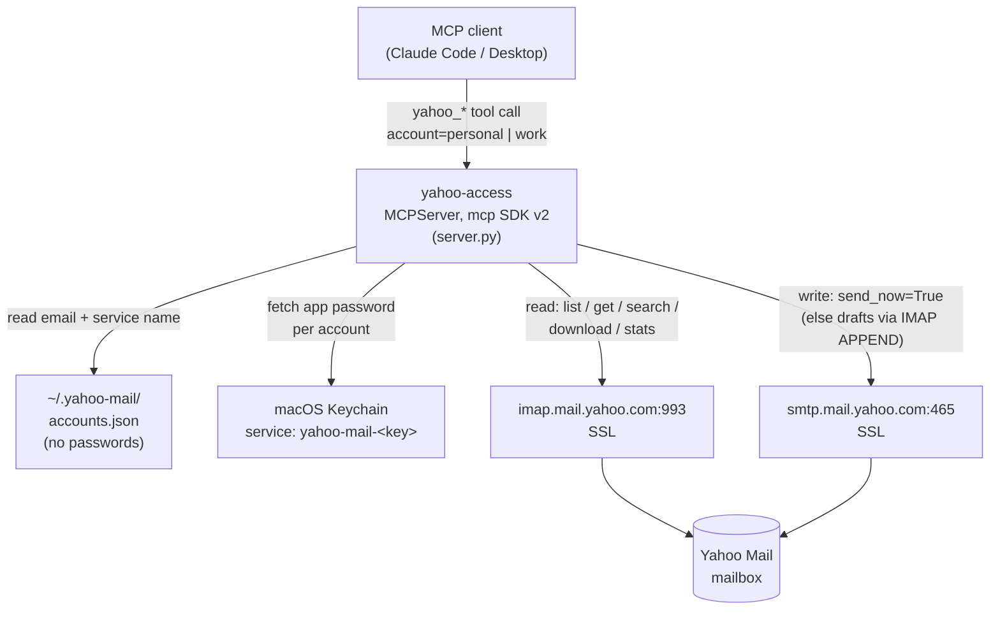

# yahoo-access

MCP server for Yahoo Mail. IMAP read, SMTP send, multiple accounts, draft-first writes.

[](https://github.com/weirdapps/yahoo-access/actions/workflows/ci.yml)
[](LICENSE)
[](https://www.python.org/downloads/)

## What this is

A [Model Context Protocol](https://modelcontextprotocol.io/) server that exposes a Yahoo Mail mailbox to any MCP client (Claude Code, Claude Desktop, etc.). It talks IMAP for reads and SMTP for sends, supports several accounts side by side (keys you choose, e.g. `personal` and `work`; a call that names none uses the one the config marks as default), and defaults every send / forward to **draft-first**: the message is APPENDed to Yahoo's `Draft` folder for review, and only dispatched when the caller passes `send_now=True`.

Fork of [`sch-mail`](https://github.com/weirdapps/sch-mail) with the transport rewired for Yahoo (`imap.mail.yahoo.com` / `smtp.mail.yahoo.com`), a multi-account credential loader, quoted-mailbox handling, and destructive-op guards.

## Features

- **13 MCP tools** covering the full mailbox lifecycle. All names are prefixed `yahoo_` and every one takes an optional `account` parameter.
  - Read: `yahoo_check_auth`, `yahoo_list_folders`, `yahoo_list_mail`, `yahoo_get_mail`, `yahoo_search_mail`, `yahoo_download_attachments`, `yahoo_mail_stats`
  - Write: `yahoo_send_mail`, `yahoo_forward_mail`, `yahoo_move_mail`, `yahoo_create_folder`, `yahoo_delete_mail`, `yahoo_empty_folder`
- **Several accounts on one server.** Config lives in `~/.yahoo-mail/accounts.json`; pass `account="work"` (any key in that file) to any tool to switch, omit it for the account the file marks as default.
- **Draft-first by design.** `yahoo_send_mail` and `yahoo_forward_mail` save to Yahoo's Draft folder unless `send_now=True`. `yahoo_delete_mail` moves to Trash unless `permanent=True`. `yahoo_empty_folder` is a dry-run reporting the count unless `confirm=True`.
- **Special-folder resolution.** Draft / Sent / Trash targets are picked by IMAP special-use flag (`\Drafts`, `\Sent`, `\Trash`), then falling back to name candidates. Yahoo's special folders are the singular `Draft` and `Sent`, and a mailbox can also hold same-purpose folders without the flag (for example ones another mail client created), so name-only matching is unsafe.
- **Preflight auth check.** `yahoo_check_auth` verifies IMAP (and optionally SMTP) for one account or all, and returns actionable hints when the app password is right but IMAP is disabled on the account.
- **IMAP folder quoting** for folder names containing spaces, quotes or backslashes. `imaplib` does not quote them itself. CR, LF and NUL are refused in every folder name, message id and search query, so no argument can end an IMAP command early and start another.
- **Unicode search fallback.** Non-ASCII queries (e.g. Greek) skip IMAP SEARCH and filter client-side over a 180-day header window, because IMAP SEARCH does not carry non-ASCII reliably across servers. Only headers are fetched on this path, so a non-ASCII query matches Subject and From only: `field="body"` finds nothing and `field="all"` silently narrows to subject plus sender.
- **Attachment forwarding preserves payloads** by re-attaching each part from the source message, not by re-encoding text bodies.
- **Hostile-message tolerant.** A sender-declared charset Python does not know falls back to UTF-8 instead of failing the call, a malformed encoded-word or an attachment name that will not decode comes back as the raw text, a header carrying raw 8-bit bytes still reads as text, a MIME tree nested too deep to walk comes back as an error, and HTML stripping runs in linear time, so one crafted message cannot break listing or reading the rest of the mailbox.
- **Keychain-first credential loader.** App passwords resolve macOS Keychain, then env var, then inline. No secrets land in the repo, nor in the config file unless you use the inline fallback.
- **Fenced file access.** Attachments are read only from, and downloads written only into, an allowlist of folders, by default just `~/Downloads` and the temp folders (see [File access](#file-access)). A path outside it is refused with an error, never silently skipped.

## Prerequisites (per Yahoo account)

1. Enable **2-step verification**, then generate an **app password** (Account Security -> External connections -> Create app password). Yahoo does not accept your login password over IMAP / SMTP.
2. Enable **IMAP**: Yahoo Mail -> Settings -> More Settings -> Mailboxes -> IMAP. If IMAP is off, every login fails with an auth error even when the app password is correct. `yahoo_check_auth` returns a hint pointing at this.

## Installation

Requires [uv](https://docs.astral.sh/uv/) (`pip install uv`).

```bash
# HTTPS (no SSH key required):
git clone https://github.com/weirdapps/yahoo-access.git
# or, with SSH:
git clone git@github.com:weirdapps/yahoo-access.git
cd yahoo-access
uv sync --extra dev   # builds .venv from the committed uv.lock
./setup.sh            # run once per account (stores app password in Keychain, writes config)
```

`uv sync` creates `.venv` in the repo root, which is where `run_mcp.sh` looks for the interpreter. Drop `--extra dev` for a runtime-only environment without `pytest` / `ruff`.

`setup.sh` stores the app password in the macOS Keychain (service `yahoo-mail-<key>`, e.g. `yahoo-mail-personal`) and appends the account to `~/.yahoo-mail/accounts.json`. `security` itself prompts for the password, so it never appears on a command line. Re-run once per Yahoo address you want to attach.

## Usage

### Register with Claude Code

Add the server via the Claude Code CLI:

```bash
claude mcp add yahoo-mail /absolute/path/to/yahoo-access/run_mcp.sh
```

`run_mcp.sh` execs `.venv/bin/python -m server` from the repo root. Once registered, tools appear as `mcp__yahoo-mail__yahoo_*` and the server starts on demand.

### Example tool calls

Default account (whichever `accounts.json` marks as `default`), list the last 20 messages:

```python
yahoo_list_mail(folder="INBOX", top=20)
```

Switch to another configured account, here `work`:

```python
yahoo_list_mail(folder="INBOX", top=20, account="work")
```

Search Greek text (auto-falls back to a client-side filter over 180 days, matching Subject and From only):

```python
yahoo_search_mail(query="πληρωμή", field="all")
```

Draft a reply, review in Yahoo webmail, keep or discard:

```python
yahoo_send_mail(
    to="alice@example.com",
    cc="bob@example.com",
    subject="quarterly review",
    body="<p>Draft goes here.</p>",
    html=True,
)
# -> {"status": "draft_saved", "folder": "Draft", "message_id": "<...@yahoo.com>", ...}
```

Same call, but dispatch immediately and archive to `Sent`:

```python
yahoo_send_mail(..., send_now=True)
# -> {"status": "sent", "sent_folder_archive": "Sent", ...}
```

Preflight every configured account (IMAP only, cheap):

```python
yahoo_check_auth()
# -> {"personal": {"ok": True, ...}, "work": {"ok": True, ...}}
```

Empty the Bulk folder (dry-run first, then confirmed):

```python
yahoo_empty_folder(folder="Bulk")                 # {"status": "dry_run", "would_delete": 3, ...}
yahoo_empty_folder(folder="Bulk", confirm=True)   # {"status": "emptied", "deleted": 3}
```

## Architecture



### Code organization

Single-file server (`server.py`, ~1500 lines) laid out top to bottom:

1. Constants: IMAP / SMTP hosts and ports, config and instructions paths, folder candidates, the file-access allowlist; `_build_instructions` and the `MCPServer` object.
2. Local file access: `_allowed_dirs`, `_allowed_path`, `_quarantine`.
3. Credential loader: `_load_accounts`, `_keychain_password`, `_resolve_password`, `_load_credentials`.
4. Connection helpers: `_refuse_line_breaks`, `_q` (IMAP mailbox quoting), `_connect` (IMAP4_SSL), `_smtp_connect` (SMTP_SSL).
5. `yahoo_check_auth` preflight tool.
6. Parsing helpers: charset-safe decode (`_decode_bytes`), header decode with a raw fallback (`_decode_header`), depth-safe parse (`_parse_message`), date parse, HTML strip (linear time), hostile-header-safe attachment name and disposition reads (`_get_filename`, `_disposition`), attachment enumeration.
7. Read tools: `yahoo_list_folders`, `yahoo_list_mail`, `yahoo_get_mail`, `yahoo_search_mail`, `yahoo_download_attachments`, `yahoo_mail_stats`.
8. Send helpers: `_build_message`, `_find_special_folder`, `_save_to_folder`.
9. Write tools: `yahoo_send_mail`, `yahoo_forward_mail`, `yahoo_move_mail`, `yahoo_create_folder`, `yahoo_delete_mail`, `yahoo_empty_folder`.
10. `__main__`: `mcp.run()`.

Fresh IMAP / SMTP connection per tool call, closed in `finally`. No pooling.

## Configuration

### Config file

`~/.yahoo-mail/accounts.json` (mode 600, gitignored):

```json
{
  "accounts": {
    "personal": {
      "email": "you@yahoo.com",
      "keychain_service": "yahoo-mail-personal"
    },
    "work": {
      "email": "someone.else@yahoo.com",
      "keychain_service": "yahoo-mail-work"
    }
  },
  "default": "personal"
}
```

The file holds no passwords. `setup.sh` writes it for you. The account keys are yours to choose; tools accept any key in this file, and `default` names the account used when a call names none.

### Local instructions (optional)

The server hands MCP clients a generic instructions text. If `~/.yahoo-mail/instructions.md` exists, its content is appended to that text at startup. Put installation-specific guidance there (which accounts exist and what each is for, house rules for a mailbox), so it stays out of the repo. Restart the server after editing the file.

### File access

`yahoo_send_mail` reads `attachments` only from, and `yahoo_download_attachments` writes only into, these folders (symlinks are resolved before the check):

- `~/Downloads`
- the system temp directory and `/tmp`

Folders that hold your own documents, such as `~/Documents`, `~/Desktop` or `~/Library/CloudStorage`, are left out on purpose. Message content can steer the agent calling these tools, and any file in an allowed folder can be attached to an outgoing message, so widening the list is a decision you make explicitly.

Set `YAHOO_MAIL_ALLOWED_DIRS` to a list of folders separated by `os.pathsep` (`:` on macOS and Linux) to replace that list, for example in the `env` of the MCP server entry. It replaces the defaults rather than adding to them, so name `~/Downloads` again if you still want it; `~` is expanded:

```json
"env": {"YAHOO_MAIL_ALLOWED_DIRS": "~/Downloads:~/Documents/mail-outbox"}
```

A refused path returns an error naming the variable: `yahoo_download_attachments` writes nothing, and `yahoo_send_mail` neither saves nor sends the message. Downloaded files never start with a dot: a leading `.` in a sender-supplied file name becomes `_`. On macOS each saved file is tagged `com.apple.quarantine`, as Mail.app does, so Gatekeeper still checks a sender-supplied app, script or installer when it is opened.

### Password resolution order

For account key `<key>` with `email` = `<addr>`, the loader tries:

1. **macOS Keychain**: `/usr/bin/security find-generic-password -s <keychain_service> -a <addr> -w`
2. **Environment variable**: `YAHOO_APP_PASSWORD_<KEY>` (uppercased key)
3. **Inline `password` field** in `accounts.json` (last resort, not recommended)

Only the first non-empty match is used. If all three miss, `_resolve_password` raises with a `security add-generic-password` command you can copy-paste.

### IMAP / SMTP endpoints

Hardcoded in `server.py`:

- IMAP: `imap.mail.yahoo.com:993` (SSL)
- SMTP: `smtp.mail.yahoo.com:465` (SSL)

## Development

```bash
.venv/bin/pytest -v                       # 170 tests, all offline (mocked IMAP / SMTP)
.venv/bin/ruff check server.py tests/
.venv/bin/ruff format server.py tests/
```

Pre-commit hook (see `.pre-commit-config.yaml`) runs `ruff format` and `ruff check --fix` on staged files.

CI (`.github/workflows/ci.yml`) does `uv sync --extra dev --frozen`, then runs the same `ruff check` + `pytest`, on Ubuntu with Python 3.12 for every push and PR. `--frozen` means a dependency change must land together with a refreshed `uv.lock` or CI fails.

Dependabot (`.github/dependabot.yml`) tracks `uv` and `github-actions` weekly. `.github/workflows/dependabot-auto-merge.yml` is a thin caller of the shared reusable workflow at `weirdapps/shared-workflows`: it waits for this PR's own checks and squash-merges green patch / minor bumps, leaving standalone majors open for review.

Tests live under `tests/` and never talk to Yahoo. They mock `imaplib.IMAP4_SSL` and `smtplib.SMTP_SSL`, so you can run the suite offline without any credentials configured.

## Security

App passwords live in the macOS Keychain, never in the repo. `~/.yahoo-mail/accounts.json` contains no passwords and is gitignored. The Keychain keeps them off disk in plain text, but it does not hide them from your own processes: an item `setup.sh` creates can be read back by `/usr/bin/security` without a prompt, which is how the server reads it, so any program running as your macOS user can do the same.

Message content is written by whoever sent it, and the agent calling these tools reads it. Keep `send_now=True`, forwarding and the destructive tools behind your MCP client's approval prompt. The default file-access allowlist is `~/Downloads` plus the temp folders: add a folder to it only if you would accept any file in it being attached to an outgoing message. See [SECURITY.md](SECURITY.md) for how to report a vulnerability.

## License

MIT. See [LICENSE](LICENSE).
